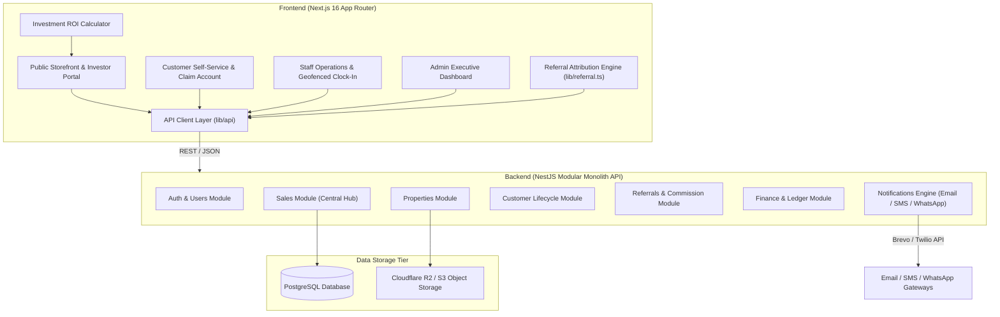

# 🏛️ El-Moore — Real Estate Investment Showcase & Enterprise Management Platform

> An enterprise-grade real estate platform crafted with **"The Financial Curator"** design ethos. Combines a bespoke private investment storefront, affiliate marketer referral engine, customer self-service portal, staff operations suite, and backend sales/installment management.

---

## 📌 Executive Summary & Product Overview

### What the Product Does
**El-Moore** is a comprehensive, dual-faceted real estate software ecosystem designed for high-end property developers and real estate investment firms. 

- **For Buyers & High-Net-Worth Investors:** A modern, editorial digital showroom ("The Financial Curator") offering property listings with land title documentation (Certificate of Occupancy, Gazette), interactive ROI calculators (Buy-to-Let vs. Buy-to-Sell), site inspection scheduling, an AI-Human hybrid helpdesk, and a self-service customer portal for tracking installment plans and contracts.
- **For Real Estate Operations & Management:** A centralized backend operations platform that handles property inventory, sales recording (outright & installment schedules), referral commission auto-calculation for affiliate marketers, staff clock-in/out with soft geofencing, daily task reports, financial income/expense ledgers, and automated multi-channel messaging (SMS, Email, WhatsApp).

---

## 🎯 The Problem It Solves

Real estate companies in emerging markets frequently face severe operational bottlenecks due to fragmented tools:
1. **Spreadsheet & WhatsApp Dependency:** Sales records, installment tracking, and site inspection schedules are trapped in manual spreadsheets or chaotic messaging threads, resulting in missed follow-ups and unrecorded payments.
2. **Untracked Affiliate Marketer Commissions:** External affiliate marketers lack visibility into sales attribution, payout status, and unique referral tracking links, creating friction and lost sales opportunities.
3. **Opaque Installment Purchases:** Customers paying over 6, 12, or 24 months lack a clear self-service view of paid vs. remaining balances, overdue flags, and legal contract documents.
4. **Disconnected Staff Operations:** Remote and on-site staff attendance, daily reports, and customer care handoffs are uncoordinated with the central sales funnel.
5. **Low-Trust Public Portals:** Traditional real estate listing sites feel cluttered and transactional, failing to convey the authority and institutional trust required for high-value land and property investments.

**El-Moore resolves these challenges by unifying customer lifecycle tracking, sales, finance, referrals, staff operations, and public investment showcasing into a single cohesive system.**

---

## 💻 Your Specific Contribution

As the lead frontend architect and UI engineer for this project, my key contributions include:

1. **Design System Engineering ("Estate Sovereign"):** Built the full design system from scratch using Next.js 16 (App Router), Tailwind CSS v4, and custom typography (brand-licensed Axiforma font). Replaced standard 1px borders with architectural surface layering, warm fine paper tones (`#FAF9F5`), forest green anchors (`#142C26`), and champagne gold accents (`#CDBF8A`).
2. **Dynamic Storefront & Financial Tools:** Designed and implemented responsive views for property detail pages, filterable catalog listings, an interactive investment ROI calculator with real-time growth modeling, and the site inspection booking engine.
3. **Resilient Dual-Mode API Integration (`lib/api/*`):** Engineered a modular, type-safe API client layer (`client.ts`) supporting live REST API communication (`NEXT_PUBLIC_API_BASE_URL`) alongside a full mock store fallback (`mock-store.ts`) for seamless offline demoing, unit testing, and isolated UI validation.
4. **Client-Side State & Attribution Engine:** Built the referral attribution tracking library (`lib/referral.ts`) that extracts marketer codes from route parameters (`/refer/:marketerCode` or `?ref=`), persists attribution metadata across sessions, and attributes customer sales.
5. **Role-Based Authorization & Customer Self-Service:** Developed RBAC utilities (`lib/rbac.ts`) for managing permission structures across Admin, MD/GM, Staff, Marketer, and Customer roles, alongside the claim-account customer onboarding flow.

---

## 📐 System Architecture

### High-Level Architecture Diagram



### Backend Domain Relational Architecture (`sales` Hub Model)

The database schema positions `sales` as the relational hub connecting all core domains:
- **`users`** (1) ──< **`sales`** (M) [via `sold_by_id` or `marketer_id`]
- **`properties`** (1) ──< **`sales`** (M)
- **`customers`** (1) ──< **`sales`** (M)
- **`sales`** (1) ──1 **`installment_plans`** (1) ──< **`installment_payments`** (M)
- **`sales`** (1) ──< **`referrals`** (M) [affiliate marketer commission auto-generation]
- **`sales`** (1) ──< **`financial_transactions`** (M) [automatic income ledger creation]
- **`sales`** (1) ──< **`sale_documents`** (M) [S3/R2 contract & title storage]

---

## 🛠️ Technologies Stack

| Tier | Technologies |
|---|---|
| **Frontend Framework** | [Next.js 16.2](https://nextjs.org/) (App Router, React 19.2, Server & Client Components) |
| **Language** | [TypeScript 5](https://www.typescriptlang.org/) (Strict mode, fully typed API contracts) |
| **Styling & Design System** | [Tailwind CSS v4](https://tailwindcss.com/), Custom Design System tokens, `@tailwindcss/postcss` |
| **Animations & UI Primitives** | [Framer Motion 12](https://www.framer.com/motion/), [Radix UI](https://www.radix-ui.com/), [Shadcn UI](https://ui.shadcn.com/), [Vaul](https://vaul.emilkowal.ski/) (Drawers) |
| **Data Visualization** | [Recharts 3](https://recharts.org/) (Sales trends, revenue/expense breakdowns) |
| **Icons & Media** | [Lucide React](https://lucide.dev/), Custom Brand Vectors |
| **Typography** | Brand-mandated **Axiforma** geometric font family (`next/font/local`) |
| **Markdown Parsing** | [React Markdown](https://github.com/remarkjs/react-markdown), [Remark GFM](https://github.com/remarkjs/remark-gfm) |
| **Backend Target (API)** | NestJS (Modular Monolith), TypeORM, PostgreSQL |
| **Notification Services** | Brevo (Email & SMS consolidation), WhatsApp Business API / Twilio |
| **Cloud Storage** | Cloudflare R2 / S3-compatible Object Storage |

---

## 🧠 Important Technical Decisions

### 1. The "No-Line" Architectural Design System
Rather than relying on generic 1px border lines to divide UI containers, the application enforces background surface layering (`#FAF9F5` base surface, elevated cards on `#FFFFFF`, sidebar insets on `#F0EEE6`) combined with subtle ambient shadows tinted with `rgba(27, 28, 26, 0.06)`. This creates a tactile, editorial layout reminiscent of private wealth investment journals.

### 2. Resilient Dual-Mode API Architecture (`lib/api/*`)
To ensure rapid iteration and zero frontend blocking during backend feature deployment, every API domain service (`properties.ts`, `sales.ts`, `referrals.ts`, etc.) imports a unified HTTP wrapper (`client.ts`). When `NEXT_PUBLIC_API_BASE_URL` is configured, requests stream to the NestJS backend. In offline or local development mode, the client transparently falls back to an in-memory mock store (`mock-store.ts` & `dashboardMockData.ts`) with `localStorage` persistence.

### 3. Sole Typeface Hierarchy (Axiforma Font Strategy)
To align strictly with the brand identity, default system fonts were eliminated. Axiforma weights (400 Regular, 500 Medium, 600 SemiBold, 700 Bold) were declared locally in `app/layout.tsx`. Visual hierarchy is governed entirely by scale, line-height (1.6 for body readability), tracking, and color elevation rather than introducing secondary fonts.

### 4. Client Attribution Engine & Persisted Marketer Tracking
Affiliate marketers receive unique referral handles (`/refer/:marketerCode` or URL parameters `?ref=...`). The client engine (`lib/referral.ts`) automatically intercepts these parameters, validates the code against the API/mock store, and stores the attribution payload with a 30-day expiration window. Any purchase initiated during this window automatically links the marketer ID to the created sale record.

### 5. Automated Customer Lifecycle Auto-Grading
The customer state model automatically transitions clients through lifecycle milestones based on activity triggers:
- **Prospect:** Initial inquiry or contact info captured.
- **Lead:** Site inspection booked or completed (`site-inspections.ts`).
- **Client:** First property sale recorded (`sales.ts`).
- **Customer:** Multiple property purchases or ongoing installment payments.

---

## ✨ Key Features

### 🏢 1. Digital Investment Showroom & Property Showcase
- High-resolution image galleries with primary cover selection.
- Detailed property specifications (land size, title documentation status: C of O, Gazette, Excision).
- Location metadata and status flags (`AVAILABLE`, `RESERVED`, `SOLD`).

### 🧮 2. Interactive Investment ROI Calculator
- Dual calculation modes: **Buy-to-Let** (rental yield projections) and **Buy-to-Sell** (capital appreciation over time).
- Dynamic sliders and real-time graph visualization for projected multi-year returns.

### 🤝 3. Affiliate Marketer System & Referral Attribution
- Dedicated self-registration and approval flow for affiliate marketers.
- Automatic commission record generation upon sale completion.
- Real-time marketer referral dashboard showing total sales, pending payout, and paid commissions.

### 📅 4. Site Inspection Booking & Automated Follow-Up
- Integrated scheduling drawer for booking physical or virtual property site tours.
- Automated WhatsApp follow-up triggers post-inspection.

### 💳 5. Installment Management & Customer Portal
- Outright vs. Installment payment plan support.
- Payment breakdown schedule with overdue flags.
- Claim-Account onboarding flow allowing existing land buyers to access their digital dashboard via email verification.
- Document Vault for downloading legal agreements, receipts, and title deeds.

### 💼 6. Staff Operations Suite
- Soft-geofenced staff clock-in/clock-out system logging IP and geographic coordinates.
- End-of-day task reporting feed for management review.

### 📊 7. Executive & Financial Analytics Dashboard
- Interactive charts powered by Recharts (sales trends, revenue vs. expenses, staff attendance rates).
- Consolidated table views for recent sales, pending commissions, and financial ledger items.

### 🤖 8. AI-Human Hybrid Helpdesk Care
- Floating AI assistant (`chatbot-fab.tsx`) for answering customer inquiries 24/7.
- Seamless escalation and handoff to human Customer Care representatives.

---

## 🎨 Screenshots & Visual Tour

| View | Description |
|---|---|
| **Landing & Showroom** | Architectural hero section featuring Axiforma typography, curated property showcase cards, and subtle paper surface layering. |
| **Property Details & ROI Calculator** | Interactive investment modeling tool allowing investors to calculate projected capital growth and rental yield. |
| **Executive Sales Dashboard** | Visual charts showing monthly sales performance, financial transactions ledger, and affiliate commission statuses. |
| **Customer Portal & Vault** | Self-service view for property buyers to view payment schedules, upcoming installments, and legal agreements. |

---

## 🚀 Live Demo & Development Server

- **Development Server:** Run locally at [http://localhost:3000](http://localhost:3000)
- **Live Demo Link:** *(Configure `NEXT_PUBLIC_API_BASE_URL` or run with local mock fallback)*

---

## ⚡ Challenges & Engineering Solutions

### Challenge 1: Achieving Depth and Hierarchy Without Border Lines
- **Problem:** Traditional web designs rely heavily on 1px borders to separate cards and lists. Removing borders often leads to visually flat or confusing interfaces.
- **Solution:** Formulated a tonal surface hierarchy (`surface` `#FAF9F5` → `surface_container_low` `#F0EEE6` → `surface_container_lowest` `#FFFFFF`) paired with soft, tinted ambient shadows `rgba(27, 28, 26, 0.06)` with a 40px blur radius. List items rely on alternating background tones and generous 1.7rem vertical whitespace (`spacing-5`).

### Challenge 2: Decoupled Frontend Development with Standalone Fallbacks
- **Problem:** Developing a rich frontend application alongside an evolving NestJS backend API can cause integration delays when endpoints are undergoing migration.
- **Solution:** Architected a modular API service layer (`lib/api/*`). Each endpoint module checks for backend server availability; if unreachable or unconfigured, it gracefully proxies requests to `mock-store.ts`, maintaining state in `localStorage`. This allowed full end-to-end user flows to be built and validated offline.

### Challenge 3: Complex Multi-Tier Role Authorization
- **Problem:** Managing distinct interface views and feature access across 8 user roles (`MD_GM`, `OFFICE_ADMIN`, `SITE_COORDINATOR`, `TEAM_LEAD`, `ACCOUNTANT`, `CUSTOMER_CARE`, `MARKETER`, `BASIC`) without cluttering components with repeated conditional logic.
- **Solution:** Created a centralized RBAC helper module (`lib/rbac.ts`) exposing clean utility functions (`canAccessDashboard`, `canManageProperties`, `canApproveMarketers`). Components pass user role context to render appropriate UI actions dynamically.

---

## ⚙️ Setup & Installation Instructions

### Prerequisites
- **Node.js:** `v18.17.0` or higher
- **Package Manager:** `npm` (v9+) or `pnpm` / `yarn` / `bun`

### 1. Clone the Repository
```bash
git clone https://github.com/Hayotunday/el-moore.git
cd el-moore
```

### 2. Configure Environment Variables
Copy `.env.example` to `.env.local`:
```bash
cp .env.example .env.local
```
Fill in the environment variables in `.env.local`:
```env
# Backend API Base URL (Leave blank to use internal mock store)
NEXT_PUBLIC_API_BASE_URL=http://localhost:3001/api/v1

# Cloudflare R2 / Object Storage Public URL
NEXT_PUBLIC_R2_PUBLIC_BASE_URL=https://assets.el-moore.com
NEXT_PUBLIC_R2_PRIVATE_BASE_URL=https://private-docs.el-moore.com
```

### 3. Install Dependencies
```bash
npm install
```

### 4. Run the Development Server
```bash
npm run dev
```
Open [http://localhost:3000](http://localhost:3000) in your browser to view the application.

### 5. Build for Production
To test the optimized production build:
```bash
npm run build
npm run start
```

### 6. Linting & Code Verification
```bash
npm run lint
```

---

## 🔥 What Makes This Project Technically Interesting

1. **"The Financial Curator" Bespoke UI Architecture:** Translates editorial publication design into a dynamic, stateful Next.js application. Enforces strict visual constraints (Axiforma typography, paper surface tones, no dividers) while maintaining accessibility and responsiveness.
2. **Unified `sales` Relational Hub Pattern:** The underlying backend architecture models `sales` as a centralized event hub. Recording a sale triggers asynchronous downstream actions: calculating affiliate commission records, creating financial income entries, initiating multi-channel payment reminder schedules, and updating customer lifecycle status.
3. **Resilient Dual-Mode Data Layer:** The frontend features an abstracted API layer (`lib/api/*`) that bridges real REST backend communication with offline typed mock data stores seamlessly.
4. **Multi-Channel Notification Orchestration:** Combines Brevo Email + SMS dispatch for transaction confirmations alongside automated cron jobs for WhatsApp site inspection follow-ups and client birthday greetings.
5. **Soft-Geofenced Attendance System:** Blends location metadata collection with staff attendance logging, flagging off-site clock-ins for management review without completely blocking workflow progress.

---

<p align="center">
  Crafted with precision for <strong>El-Moore Real Estate</strong>.
</p>
